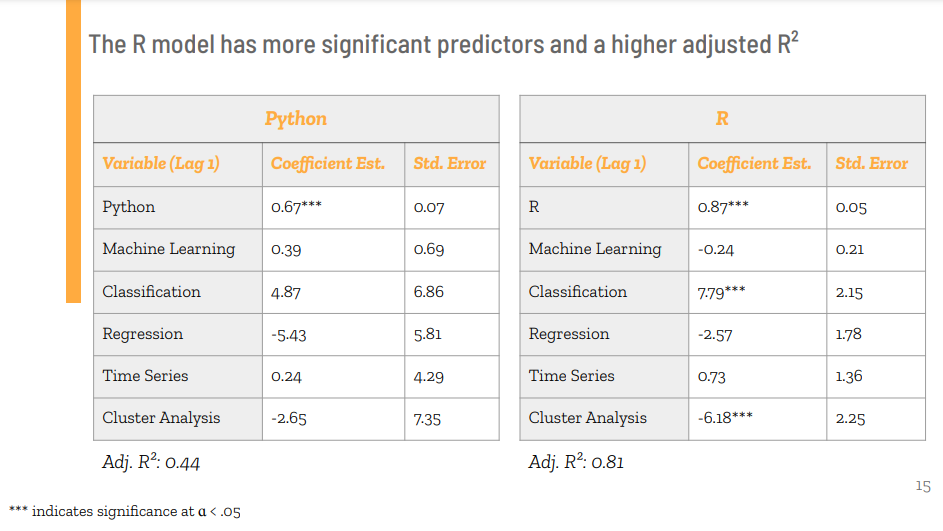

# Time Series and Experimental Design

- Authors: Alana Willis, Clare Cruz, Daniel Nason, Megan Christy

## Time Series Analysis Final Project

The presentation can be found [here](./final_project/time_series_presentation.pdf), as well as the [written report](./final_project/time_series_report.pdf).

### Project Background

### Data

The data can be found in this [repo](./final_project/time_series_project_data.csv) or on [Kaggle](https://www.kaggle.com/datasets/aishu200023/stackindex?select=MLTollsStackOverflow.csv).

### Findings

In the dataset, python has grown the most in popularity of asking StackOverflow questions, followed by R and then various statistical and machine learning topics.

#### SARIMA Models

Model fits were chosen based on residual diagnostics. While both models fit the data relatively well and project a growing trend, additional modeling is needed to determine which variables are correlated with Python and R.

#### VAR Models

Since the predictor variables of interest show a strong linear correlation with R and Python, we fit a VAR model to attempt to understand these relationships. The models show a good fit to the variables, although slightly less of a good fit compared to the SARIMA models. Interestingly, the results show that the statistical and machine learning topics are not statistically significant predictors of Python, while only Classification and Cluster Analysis are statistically significant for R.

### Conclusion

